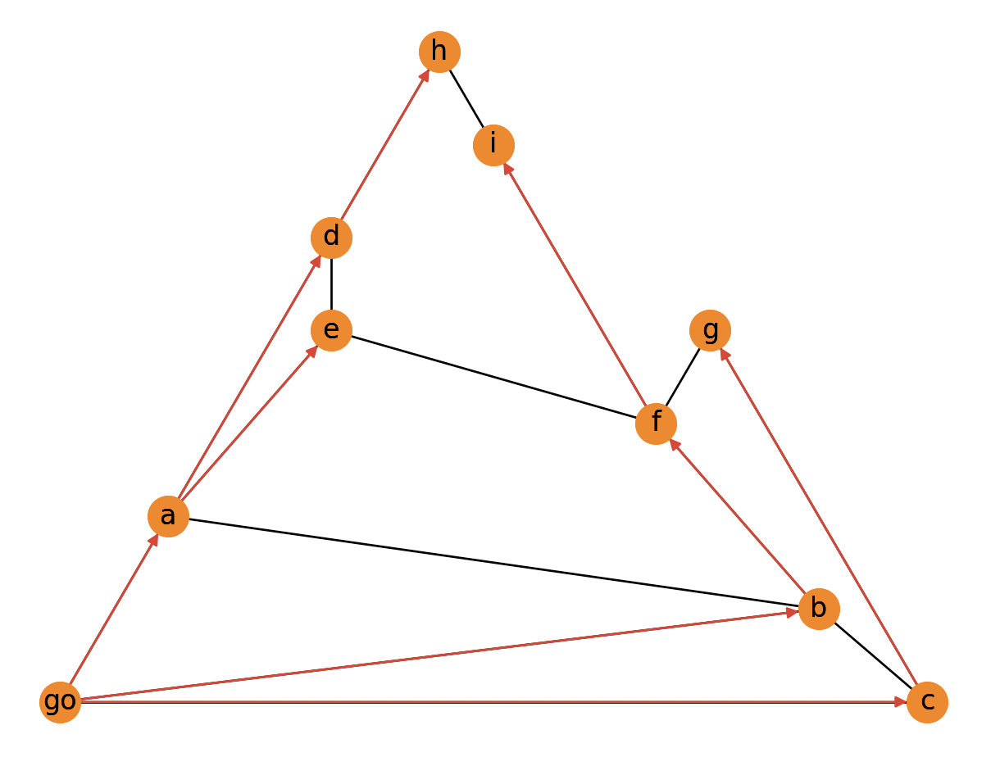

import Tabs from '@theme/Tabs'; import TabItem from '@theme/TabItem';
import CtaButton from "@site/src/components/cta-button/cta-button";

In breadth-first search (BFS) traversal starts from a single node, and the order of visited nodes is decided based on nodes' distance from the source node. This means that when a certain node is visited, it can be safely assumed that all nodes that are fewer relationships away from the source node have already been visited, resulting in the shortest path from the source node to the newly visited node.

<Tabs
  groupId="bfs"
  defaultValue="code"
  values={[
    {label: 'Graph', value: 'graph'},
    {label: 'Python code', value: 'code'},
    {label: 'Output', value: 'output'},
  ]
}>
  <TabItem value="graph"> 

Let's say you have a graph in the `graph.txt` file:

```
go a
go b
go c
a d
a e
a b
b f
b c
c g
d h
d e
e f
f i
g f
h i
```
  </TabItem>

  <TabItem value="code"> 

Then you can read the graph, calculate shortest paths with breadth-first search algorithm and draw the results: 


```python
import networkx as nx
import matplotlib.pyplot as plt


with open("graph.txt") as f:
    lines = f.readlines()

edgeList = [line.strip().split() for line in lines]

g = nx.Graph()
g.add_edges_from(edgeList)

pos = nx.planar_layout(g)

nx.draw(g, pos, with_labels=True, node_color="#f86e00")

bfs = nx.bfs_tree(g, source="go")

nx.draw(bfs, pos, with_labels=True, node_color="#f86e00", edge_color="#dd2222")

plt.show()
```
  </TabItem>

  <TabItem value="output">



  </TabItem>

</Tabs>

## Where to next?

There are many graph algorithms libraries out there, with their own implementations of breadth-first search algorithm. NetworkX's algorithms are written in Python, and there are many other libraries that offer faster C++ implementations, such as [**MAGE**](https://github.com/memgraph/mage), a graph algorithms library developed by Memgraph team.

<CtaButton title="Memgraph for NetworkX developers" url="https://memgraph.com/memgraph-for-networkx?utm_source=networkx-guide&utm_medium=referral&utm_campaign=networkx_ppp&utm_term=graphtraversals%2Bbfs&utm_content=ctabutton"></CtaButton>
