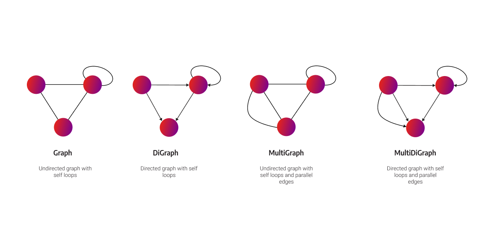
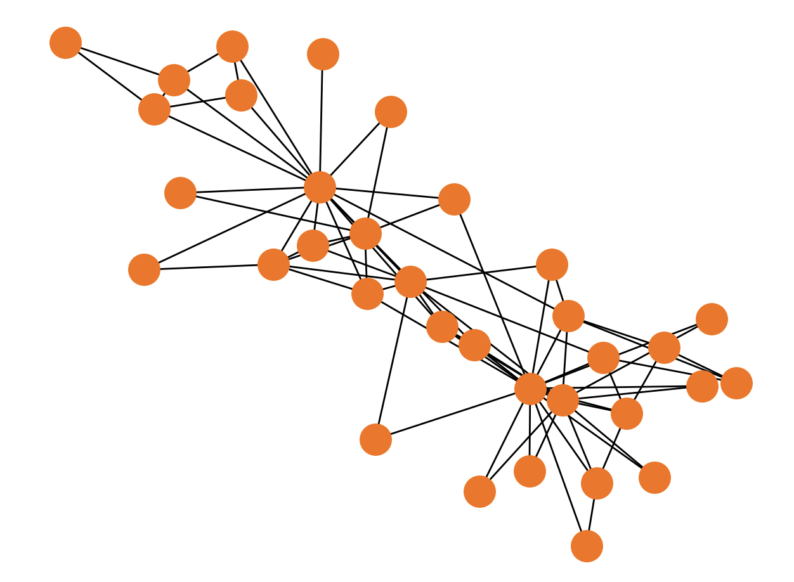
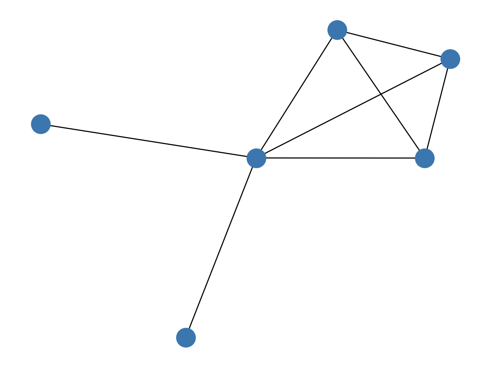

import Tabs from '@theme/Tabs'; import TabItem from '@theme/TabItem';

In this guide you'll learn how to:

- differentiate [**NetworkX graph types**](#networkx-graph-types), 
- create a graph by [**generating**](#graph-generators) it, [**reading**](#reading-graphs) it or [**adding**](#adding-nodes-and-edges) nodes and edges,
- [**remove**](#removing-nodes-and-edges-from-the-graph) nodes and edges from the graph,
- [**examine**](#graph-examination) a graph,
- [**write**](#writing-graphs) a graph to a file.

## NetworkX graph types

The model of the graph structure in NetworkX is similar to the labeled-property graph. Regarding the naming convention, relationships are called edges, and properties are called attributes in NetworkX. You can use the following NetworkX graph classes:



## Graph creation

NetworkX graph objects can be created in three ways:

- using the [**graph generators**](#graph-generators) - standard algorithms to create network topologies,
- by [**reading**](#reading-graphs) from different formats,
- by [**adding nodes and edges**](#adding-nodes-and-edges) explicitly.

It is also possible to [**remove nodes and edges**](#removing-nodes-and-edges-from-the-graph) from your graph.

### Graph generators

There are many types of graph generators inside NetworkX. They create predefined network structures, so that you can continue on exploring it and learning more about graph algorithms. Some of the most often used generators are:

- `balanced_tree()`
- `complete_graph()`
- `cycle_graph()`
- `star_graph()`
- `karate_club_graph()`

**Example:**

<Tabs
  groupId="graph_generators"
  defaultValue="code"
  values={[
    {label: 'Python code', value: 'code'},
    {label: 'Output', value: 'output'},
  ]
}>
  <TabItem value="code"> 

Let's generate and draw Zachary’s Karate Club graph with the following Python code:

```python
import networkx as nx
import matplotlib.pyplot as plt

generated_graph = nx.karate_club_graph()
pos = nx.spring_layout(generated_graph, scale=0.5)
nx.draw(generated_graph, pos)

plt.show()
```
  </TabItem>


  <TabItem value="output">

  The output of the previous Python code looks like this:



  </TabItem>

</Tabs>

This kind of graph creation is good enough for testing, but be careful, since each time you start your script, the data has to be loaded in-memory. To learn more about it, head over to our [**FAQ**](/faq#generated-graph).

### Reading graphs

Data can be imported from many different sources and file formats: Adjacency List, Multiline Adjacency List, Edge List, GEXF, GML, Pickle, GraphML, JSON, LEDA, SparseGraph6, Pajek, GIS Shapefile and Matrix Market.

Check out the example below to see how to read a graph from CSV file.

<Tabs
  groupId="reading_graphs"
  defaultValue="csv"
  values={[
    {label: 'CSV file', value: 'csv'},
    {label: 'Python code', value: 'code'},
    {label: 'Output', value: 'output'},
  ]
}>
<TabItem value="csv">

Let's say we have the following `graph.csv` file:

```csv
source,target
1,2
1,3
2,3
1,4
2,4
3,4
1,5
1,6
```
</TabItem>
  <TabItem value="code"> 

Let's import the `graph.csv` file and draw the graph:

```python
import networkx as nx
import matplotlib.pyplot as plt
import pandas as pd

graph_type = nx.Graph()
df = pd.read_csv('graph.csv')
G = nx.from_pandas_edgelist(df, create_using=graph_type)

nx.draw(G)
plt.show()
```
  </TabItem>


  <TabItem value="output">

  The output of the previous Python code looks like this:



  </TabItem>

</Tabs>

This kind of graph creation is great and fast for smaller datasets. If your dataset becomes too large, you can run into memory issues. Read more about it [**here**](/faq#store-huge-graph).

### Adding nodes and edges

All NetworkX graph classes allow hashable Python objects (except `None`) as nodes. Hashable objects include a text string, an image, an XML object, another Graph, a customized node object, and more. **Nodes** can be added and manipulated by using the following methods:

- `G.add_node(node)` - add a single node to graph `G`
- `G.add_nodes_from(nodes)` - add nodes from container of nodes to graph `G`
- `G.remove_node(node)` - remove node from all adjacent edges from graph `G`
- `G.remove_nodes_from(nodes)` - remove nodes from container of nodes from graph `G`

**Edges** often have data associated with them. Any Python object can be assigned as an edge attribute. Edges can be added and manipulated by using the following methods:

- `G.add_edge(u, v)` - add edge between nodes `u` and `v` in graph `G`
- `G.add_edges_from(ebunch)` - add edges from the container of edges to graph `G`
- `G.add_weighted_edges_from(ebunch)` - add weighted edges from the container of edges to graph `G`
- `G.remove_edge(u, v)` - remove edge between nodes `u` and `v` from graph `G`
- `G.remove_edges_from(ebunch)` - remove edges from list or container of edge tuples from graph `G`

Check out the usage of the above procedures in the following example.

<Tabs
  groupId="adding_nodes_and_edges"
  defaultValue="code"
  values={[
    {label: 'Python code', value: 'code'},
    {label: 'Output', value: 'output'},
  ]
}>
  <TabItem value="code"> 

The following Python code shows how to add one or multiple nodes and edges. It will also draw a graph with Matplotlib library.

```python
import networkx as nx

import matplotlib.pyplot as plt

g = nx.Graph()

# Adding one node
g.add_node("1", label="Person", name="Kevin Bacon", age=64)

# Adding multiple nodes
g.add_nodes_from(
    [
        ("2", {"label": "Person", "name": "Ian McKellen", "age": 83}),
        ("3", {"label": "Person", "name": "James McAvoy", "age": 43}),
        ("4", {"label": "Person", "name": "Michael Fassbender", "age": 45}),
    ]
)

# Adding one edge
g.add_edge("1", "3", type="ACTED_WITH")

# Adding multiple edges
g.add_edges_from([("1", "4"), ("2", "3"), ("2", "4")], type="ACTED_WITH")

# Graph drawing
pos = nx.circular_layout(g)
nx.draw(g, pos, node_size=10000)

labels = nx.get_node_attributes(g, "name")
edge_labels = nx.get_edge_attributes(g, "type")

nx.draw_networkx_labels(g, pos, labels=labels, font_size=10, font_color="white")
nx.draw_networkx_edge_labels(g, pos, edge_labels=edge_labels, font_size=10)

plt.show()
```
  </TabItem>


  <TabItem value="output">

  The output of the previous Python code looks like this:


  </TabItem>

</Tabs>

This kind of graph creation is great and fast for smaller datasets. If your dataset becomes too large, you can run into memory issues. Read more about it [**here**](/faq#load-graph).

### Removing nodes and edges from the graph

The following methods are used to remove nodes and edges:

- `Graph.remove_node()`
- `Graph.remove_nodes_from()`
- `Graph.remove_edge()`
- `Graph.remove_edges_from()`

Check out the usage of the above procedures in the following example.

<Tabs
  groupId="removing_nodes_and_edges"
  defaultValue="code"
  values={[
    {label: 'Python code', value: 'code'},
    {label: 'Output', value: 'output'},
  ]
}>
  <TabItem value="code"> 

The following Python code shows how to remove one or multiple nodes and edges.

```python
import networkx as nx

g = nx.Graph()
g.add_nodes_from([1, 2, 3, 4, 5, 6])
g.add_edges_from([(1, 2), (2, 3), (3, 4), (3, 5), (4, 5), (4, 6), (5, 6)])
print(g.nodes)
print(g.edges)

g.remove_node(1)
print(g.nodes)
print(g.edges)

g.remove_nodes_from([2, 3])
print(g.nodes)
print(g.edges)

g.remove_edges_from([(4, 5), (4, 6)])
print(g.nodes)
print(g.edges)
```
  </TabItem>


  <TabItem value="output">

  The output of the previous Python code looks like this:

```python
[1, 2, 3, 4, 5, 6]
[(1, 2), (2, 3), (3, 4), (3, 5), (4, 5), (4, 6), (5, 6)]
[2, 3, 4, 5, 6]
[(2, 3), (3, 4), (3, 5), (4, 5), (4, 6), (5, 6)]
[4, 5, 6]
[(4, 5), (4, 6), (5, 6)]
[4, 5, 6]
[(5, 6)]
```

Notice how when the node `1` was removed, all edges incident with the removed node were also removed from the graph.

  </TabItem>

</Tabs>


## Graph examination
 
Let's define a simple graph `G`.

```python
import networkx as nx

g = nx.Graph()
g.add_nodes_from([1, 2, 3, 4, 5, 6])
g.add_edges_from([(1, 2), (2, 3), (3, 4), (3, 5), (4, 5), (4, 6), (5, 6)])
```

To list the nodes and edges in the graph use the following code:

<Tabs
  groupId="listing_nodes_and_edges"
  defaultValue="code"
  values={[
    {label: 'Python code', value: 'code'},
    {label: 'Output', value: 'output'},
  ]
}>
  <TabItem value="code"> 

```python
print(G.nodes)
print(G.edges)
```
  </TabItem>


  <TabItem value="output">

  The output of the previous Python code looks like this:

```python
[1, 2, 3, 4, 5, 6]
[(1, 2), (2, 3), (3, 4), (3, 5), (4, 5), (4, 6), (5, 6)]
```
  </TabItem>

</Tabs>


To check out its number of nodes or edges, use the `number_of_nodes()` and `number_of_edges()` methods.

<Tabs
  groupId="listing_number"
  defaultValue="code"
  values={[
    {label: 'Python code', value: 'code'},
    {label: 'Output', value: 'output'},
  ]
}>
  <TabItem value="code"> 

```python
print(G.number_of_nodes())
print(G.number_of_edges())
```
  </TabItem>


  <TabItem value="output">

  The output of the previous Python code looks like this:

```python
6
7
```
  </TabItem>

</Tabs>

To check degrees of a set of nodes, that is, with how many edges those nodes are incident with, use `G.degree()` method.

<Tabs
  groupId="degree"
  defaultValue="code"
  values={[
    {label: 'Python code', value: 'code'},
    {label: 'Output', value: 'output'},
  ]
}>
  <TabItem value="code"> 

```python
print(G.degree([4, 5]))
```
  </TabItem>


  <TabItem value="output">

  The output of the previous Python code looks like this:

```python
[(4, 3), (5, 3)]
```
  </TabItem>

</Tabs>

## Writing graphs

NetworkX graph can be exported from many different sources and file formats: Adjacency List, Multiline Adjacency List, Edge List, GEXF, GML, Pickle, GraphML, JSON, LEDA, SparseGraph6, Pajek, GIS Shapefile and Matrix Market.

In the below example you can see how to export graph into three different file formats - Adjacency List and GML.

<Tabs
  groupId="write"
  defaultValue="code"
  values={[
    {label: 'Python code', value: 'code'},
    {label: 'Adjacency List', value: 'adjlist'},
    {label: 'GML', value: 'gml'},
  ]
}>
  <TabItem value="code"> 

```python
import networkx as nx

G = nx.petersen_graph()
nx.write_adjlist(G, "graph.adjlist")
nx.write_gml(G, "graph.gml")
nx.write_graphml(G, "graph.graphml")
```
  </TabItem>


  <TabItem value="adjlist">

```
# Petersen Graph
0 1 4 5
1 2 6
2 3 7
3 4 8
4 9
5 7 8
6 8 9
7 9
8
9
```
  </TabItem>

  <TabItem value="gml">

```json
graph [
  name "Petersen Graph"
  node [
    id 0
    label "0"
  ]
  node [
    id 1
    label "1"
  ]
  node [
    id 2
    label "2"
  ]
  node [
    id 3
    label "3"
  ]
  node [
    id 4
    label "4"
  ]
  node [
    id 5
    label "5"
  ]
  node [
    id 6
    label "6"
  ]
  node [
    id 7
    label "7"
  ]
  node [
    id 8
    label "8"
  ]
  node [
    id 9
    label "9"
  ]
  edge [
    source 0
    target 1
  ]
  edge [
    source 0
    target 4
  ]
  edge [
    source 0
    target 5
  ]
  edge [
    source 1
    target 2
  ]
  edge [
    source 1
    target 6
  ]
  edge [
    source 2
    target 3
  ]
  edge [
    source 2
    target 7
  ]
  edge [
    source 3
    target 4
  ]
  edge [
    source 3
    target 8
  ]
  edge [
    source 4
    target 9
  ]
  edge [
    source 5
    target 7
  ]
  edge [
    source 5
    target 8
  ]
  edge [
    source 6
    target 8
  ]
  edge [
    source 6
    target 9
  ]
  edge [
    source 7
    target 9
  ]
]
```
  </TabItem>

</Tabs>

This NetworkX feature is often being used when a lot of time is wasted on the graph loading each time you want to analyze the graph. This happens because NetworkX has to load graph in memory on each run. You can find an answer on what is the best solution to avoid performance loss due to graph loading in our [**FAQ section**](/faq#store-huge-graph). 

## Where to next?

There are many other [**learning resources**](https://memgraph.com/memgraph-for-networkx?utm_source=networkx-guide&utm_medium=referral&utm_campaign=networkx_ppp&utm_term=getting%2Bstarted&utm_content=learningresources), such as courses, whitepapers and blog posts. With the help of these valuable resources, you can learn more about the importance of graph analytics and which tools are out there to help you. Also, if you run into a common NetworkX problem, don't forget to check out our [**FAQ**](/faq) section.
